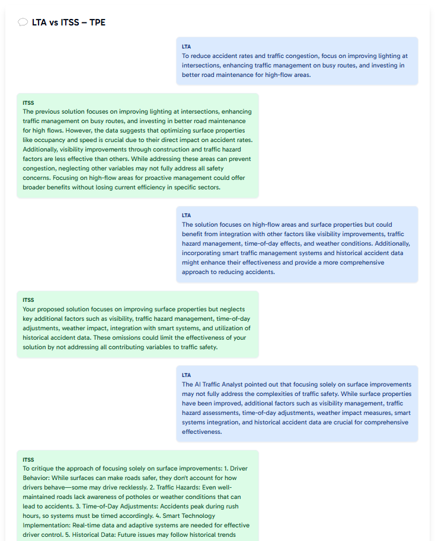

# ITSxLTA-Hackathon2025 - **SAME** (Software Advisor for Monitoring of Expressways)

## **Problem Statement**  
Singapore’s expressways experience thousands of accidents annually, with **fatalities and congestion steadily rising**. These issues are especially prevalent on highways where vehicles travel faster with reduced reaction times, causing higher cases of sudden braking and lane cutting, resulting in a greater number of accidents.

While the Intelligent Transport Systems (ITS) Operations Control Centre (OCC) and **Expressway Monitoring Advisory System (EMAS)** provide monitoring capabilities, these solutions remain **REACTIVE** - since operators are only notified WHEN incidents occur, requiring manual verification before operators can respond. This delay impacts response efficiency, increases congestion, and heightens the risk of secondary accidents.

To enhance **situational awareness** and **decision-making**, we need a **PROACTIVE** system that can not only automate detection, but **generate real-time insights and improve long-term traffic planning  too**.  

## **Our Approach**  
SAME is an **AI-powered enhancement** on top of existing traffic management systems, transforming reactive monitoring into **proactive traffic intelligence**. _(SAME is thus similar to EMAS, but not the 'same'... wordplay btw)_

Our solution consists of **three key components**:  

### **1. Real-Time AI-Powered Traffic Monitoring**  
- Joint usage of **computer vision techniques** on live LTA camera feeds to **detect accidents, classify incidents, and analyze optical flow data**.  
- Reduces **detection and verification time**, enabling **faster emergency response**.  
- Stores traffic data in our database for **real-time monitoring and historical analysis** to support proactive monitoring and long-term insights.

### **2. Interactive Live Map & Traffic Dashboard**  
- Provides a **real-time map** of **camera locations and angles, traffic flow, and accident alerts**, allowing operators to **instantly verify incidents**.
- Displays a **traffic overview dashboard** with **aggregated congestion levels, vehicle counts, accident alerts, and weather data** by expressway, allowing operators to get a high level overview of various conditions and incident risks.
- Prioritizes high-risk areas, helping operators **focus on regions with greater risks of incidents first**.  

### **3. AI-Driven Traffic Planning via LLM Debate System**  
- Uses **two specialized LLMs** to **debate and refine** traffic solutions:  
    - **Creative LLM** proposes **new strategies** to reduce congestion and accidents.  
    - **Feasibility LLM** evaluates practicality, ensuring **realistic and data-backed solutions**.  
- Leverages **historical accident data, expressway relationships, and sensor analytics** to generate **actionable recommendations for planners**.
- Helps planners **save time, consider diverse perspectives, and make informed decisions** to improve long-term traffic management.

## **Key Benefits**  

1) **Faster Incident Detection** - AI-powered automation reduces manual monitoring delays.  

2) **Enhanced Situational Awareness** - Real-time high level insights allow for **quicker, more informed responses**.  

3) **Predictive Traffic Intelligence** - Data-driven planning helps notify and prevent congestion and accidents **before they happen**.  

4) **More Efficient Planning** - AI-assisted debate streamlines decision-making for **future road improvements**.  

By **combining real-time proactive AI detection, an interactive monitoring system, and intelligent traffic planning**, SAME revolutionizes traffic management, making Singapore’s expressways **safer, smarter, and more efficient**.
